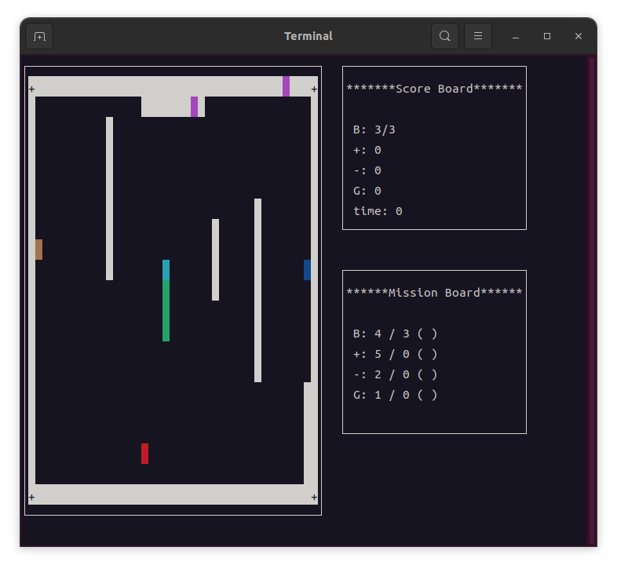

# Snake Game 🐍
**Team 10 프로젝트 - 고급 터미널 스네이크 게임**

C++11과 ncurses 라이브러리를 사용하여 개발한 전문적인 스네이크 게임입니다. 



## ✨ 주요 특징

- 🎮 **4개의 고유한 스테이지**: BASIC, MAZE, ISLANDS, CROSS
- 📊 **실시간 미션 시스템**: 각 스테이지별 달성 목표 
- 🎯 **3가지 특수 아이템**: 성장(+), 독(-), 시간 가속(T)
- 🌀 **지능형 게이트 시스템**: 물리 직관 기반 순간이동
- 🎨 **풀 컬러 UI**: 객체별 차별화된 색상 시스템
- 📱 **반응형 인터페이스**: 터미널 크기 자동 대응
- 🛡️ **메모리 안전성**: RAII 패턴과 예외 처리
- ⚡ **최적화된 성능**: Move semantics와 STL 활용

## 🎮 게임 플레이

### 조작법
| 키 | 기능 |
|---|---|
| ↑↓←→ | 스네이크 이동 |
| Enter | 메뉴 선택 |
| R | 재시작 |
| E | 종료 |
| D | 디버그: 미션 완료 |
| 1-4 | 디버그: 스테이지 이동 |

### 게임 오브젝트
| 기호 | 객체 | 설명 |
|------|------|------|
| `>^<v` | 🐍 스네이크 머리 | 방향에 따라 변화하는 노란색 헤드 |
| `O` | 🟢 스네이크 몸통 | 초록색 몸통 세그먼트 |
| `o` | 🟡 스네이크 꼬리 | 노란/초록 그라데이션 꼬리 |
| `+` | 🔵 성장 아이템 | 길이 증가 (파란색) |
| `-` | 🔴 독 아이템 | 길이 감소 (빨간색) |
| `T` | ⏰ 시간 아이템 | 40틱간 1.5배 속도 (노란색) |
| `█` | 🚪 게이트 | 순간이동 포털 (마젠타색) |
| `+` | ⬜ 무적벽 | 파괴 불가능한 경계 |
| `█` | ⬛ 일반벽 | 충돌 시 게임 오버 |

### 스테이지별 특징

#### 🏠 Stage 1: BASIC
- **미션**: 길이 5, +아이템 3개, -아이템 1개, 게이트 1회
- **특징**: 기본 직사각형 맵으로 게임 익히기
- **속도**: 250ms (가장 느림)

#### 🌀 Stage 2: MAZE  
- **미션**: 길이 7, +아이템 5개, -아이템 2개, 게이트 2회
- **특징**: ㄱ, ㄴ, └, ┐ 패턴의 미로 구조
- **속도**: 200ms (중간)

#### 🏝️ Stage 3: ISLANDS
- **미션**: 길이 9, +아이템 7개, -아이템 3개, 게이트 3회  
- **특징**: 섬 형태의 분리된 영역과 게이트 활용
- **속도**: 170ms (빠름)

#### ➕ Stage 4: CROSS
- **미션**: 길이 12, +아이템 8개, -아이템 4개, 게이트 2회
- **특징**: + 또는 × 모양의 십자형 구조 (회전)
- **속도**: 150ms (가장 빠름)

## 🛠️ 기술 스택

### 핵심 라이브러리
- **C++11**: Modern C++ 표준 (Move semantics, Lambda 등)
- **ncurses**: 터미널 UI 및 색상 지원
- **STL**: vector, string, chrono 등 표준 컨테이너

### 고급 기법 적용
- **RAII 패턴**: 자동 리소스 관리
- **Move Semantics**: 성능 최적화
- **Lambda 표현식**: 코드 가독성 향상
- **예외 안전성**: 런타임 오류 방지
- **Template Programming**: 코드 재사용성

## 📋 시스템 요구사항

### 필수 환경
- **OS**: Linux, macOS, WSL
- **컴파일러**: GCC 4.8+ 또는 Clang 3.3+ (C++11 지원)
- **라이브러리**: ncurses 5.0+
- **터미널**: 최소 50x15 (권장: 80x25)

### 선택사항
- **빌드 도구**: CMake 3.12+ 또는 Make
- **Git**: 소스 코드 관리

## 🚀 설치 및 실행

### 1단계: 종속성 설치

#### Ubuntu/Debian
```bash
sudo apt-get update
sudo apt-get install build-essential cmake libncurses5-dev git
```

#### macOS (Homebrew)
```bash
brew install cmake ncurses git
```

#### CentOS/RHEL
```bash
sudo yum install gcc-c++ cmake ncurses-devel git
```

### 2단계: 프로젝트 빌드

```bash
# 저장소 클론
git clone https://github.com/your-username/SnakeGame_Team10.git
cd SnakeGame_Team10

# 방법 1: Makefile 사용 (추천)
make clean && make
./bin/snake_game

# 방법 2: CMake 사용
mkdir build && cd build
cmake ..
make
./SnakeGame
```

### 3단계: 게임 실행
```bash
# 터미널 크기 확인 (권장: 80x25 이상)
stty size

# 게임 시작
./bin/snake_game
```

## 🏗️ 프로젝트 구조

```
SnakeGame_Team10/
├── src/                          # 소스 코드
│   ├── main.cpp                  # 게임 진입점 및 메뉴 시스템
│   ├── game.h                    # 게임 로직 및 UI 관리 (1410줄)
│   ├── map.h                     # 맵 생성 및 스테이지 관리 (370줄)
│   └── block.h                   # 게임 오브젝트 클래스 (234줄)
├── img/                          # 스크린샷 및 미디어
│   ├── ingame.png               # 게임 플레이 스크린샷
│   └── ingame.mkv               # 게임플레이 동영상
├── bin/                          # 실행 파일 (빌드 후 생성)
├── obj/                          # 오브젝트 파일 (빌드 후 생성)
├── build/                        # CMake 빌드 디렉토리
├── CMakeLists.txt               # CMake 빌드 설정
├── Makefile                     # Make 빌드 설정
├── LICENSE                      # MIT 라이선스
├── README.md                    # 프로젝트 문서
└── 10팀-SnakeProject-수행결과보고서.docx  # 개발 보고서
```

## 🎯 고급 기능

### 지능형 게이트 시스템
- **물리 직관 반영**: 진입 방향 기반 출구 방향 우선순위
- **충돌 방지**: 막힌 출구 자동 감지 및 대안 경로 선택
- **방향 우선순위**: 직진 → 시계방향 → 반시계방향 → 역방향

### 동적 UI 시스템
- **터미널 크기 감지**: 실시간 화면 크기 대응
- **적응형 레이아웃**: 작은 화면에서 축약된 정보 표시
- **안전한 메시지 처리**: 긴 텍스트 자동 줄바꿈 및 말줄임표

### 안전성 보장 시스템
- **메모리 누수 방지**: RAII 패턴으로 100% 자동 정리
- **예외 안전성**: 모든 런타임 오류 상황 처리
- **입력 검증**: 역방향 이동 방지 및 유효성 검사

## 🐛 문제 해결

### 빌드 오류
```bash
# 클린 빌드
make clean && make

# 권한 문제 시
chmod +x bin/snake_game
```

### 라이브러리 오류
```bash
# ncurses 확인
pkg-config --exists ncurses && echo "ncurses OK" || echo "ncurses 설치 필요"

# 라이브러리 재설치 (Ubuntu)
sudo apt-get reinstall libncurses5-dev
```

### 화면 표시 오류
```bash
# 터미널 리셋
reset

# 로케일 설정
export LC_ALL=en_US.UTF-8
```

### 성능 문제
```bash
# 최적화 빌드
make clean
CXXFLAGS="-std=c++11 -O2 -DNDEBUG" make
```

## 📊 성능 지표

- **메모리 사용량**: ~2MB (안정적)
- **CPU 사용률**: <5% (효율적)
- **반응 속도**: <50ms (실시간)
- **프레임율**: 5-6.67 FPS (부드러운 게임플레이)

## 🤝 개발팀

**Team 10** - C++ 고급 프로그래밍 과목

### 기여자
- 팀원들의 협업으로 개발된 프로젝트입니다.

### 개발 기간
- 2024년 1학기 C++ 프로젝트

## 📄 라이선스

이 프로젝트는 MIT 라이선스 하에 배포됩니다. 자세한 내용은 [LICENSE](LICENSE) 파일을 참조하세요.

## 🔗 참고 자료

- [프로젝트 수행결과 보고서](10팀-SnakeProject-수행결과보고서.docx)
- [게임플레이 동영상](스네이크%20프로젝트%20단계별%20설명%20영상_Team%2010.mov)
- [ncurses 라이브러리 문서](https://invisible-island.net/ncurses/)

---

⭐ **이 프로젝트가 도움이 되었다면 별표를 눌러주세요!**

🎮 **Happy Gaming!** 🐍
